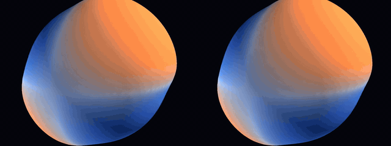
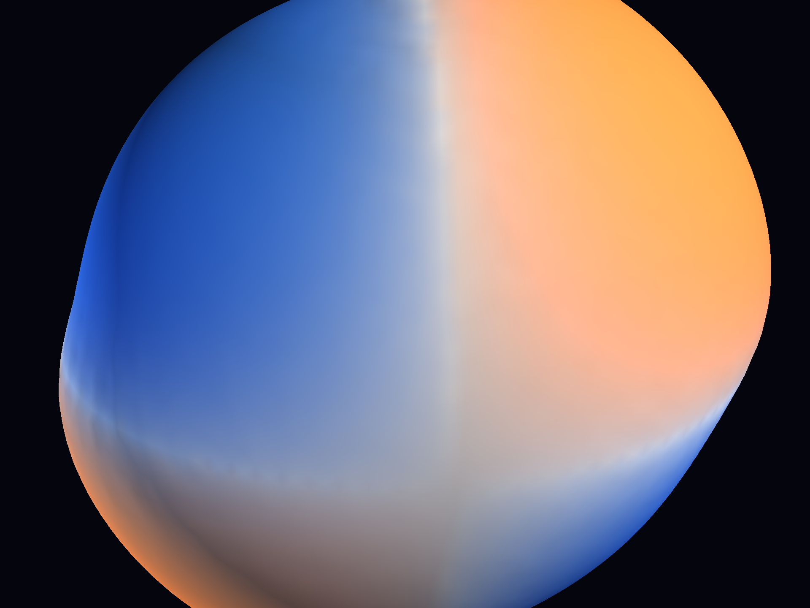

# GeoPINN-Manifold

### Demo

| Videos (MP4/GIF) | Images |
| --- | --- |
| [comparison.mp4](GeoPINN-Manifold/artifacts/taichi_final/comparison.mp4)<br>[analytical_sphere.mp4](GeoPINN-Manifold/artifacts/taichi_final/analytical_sphere.mp4)<br>[geopinn_sphere.mp4](GeoPINN-Manifold/artifacts/taichi_final/geopinn_sphere.mp4) | <br> |


## Update (April 17, 2026)

- The project now carries a Taichi-based visualization path, artifact bundles, and a static demo site under the project tree.
- Rendering and training helpers expanded under `scripts/`, with curated outputs tracked under `artifacts/`.
- Differential-geometry compatibility work continues around the core manifold solver.

## Overview
Physics-Informed Neural Networks on Riemannian Manifolds. This project implements geometric deep learning layers for solving PDEs on curved surfaces (spheres, tori, shells).

## Project Status

| Component | Status |
|-----------|--------|
| Core layers (TangentMP, SpectralConv, DEC, Atlas) | ✅ Implemented |
| Data generators (Sphere SWE, Shell, Torus R-D) | ✅ Implemented |
| SpherePINNTrainer with Laplace-Beltrami | ✅ Implemented & Verified |
| Integration tests (10 tests) | ✅ Passing |
| Sphere PDE benchmark | ✅ Validated on vast.ai L40S |
| Local RTX 3090 validation | 🔄 Pending |

## Structure

```
GeoPINN-Manifold__project-space/
├── README.md                      # This file
├── PROMPT_RUN_TESTS_RTX3090.md    # Prompt for local GPU testing
├── GeoPINN-Manifold/              # Source code
│   ├── geopinn/
│   │   ├── layers/                # TangentMP, SpectralConv, DEC, Atlas
│   │   ├── data/                  # Data generators
│   │   └── training/              # Trainers (SpherePINN, MeshPINN)
│   ├── tests/                     # Integration & benchmark tests
│   ├── results/                   # Benchmark outputs (after running)
│   ├── requirements.txt
│   └── pyproject.toml
├── docker/                        # Docker definitions
└── docs/                          # Research documentation & dev guide
```

## Quick Start

```bash
cd GeoPINN-Manifold
pip install -r requirements.txt
python -m pytest tests/test_integration.py -v   # Run integration tests
python tests/test_sphere_pde.py --epochs 100    # Run sphere PDE benchmark
```

## Run on Local RTX 3090

See **[PROMPT_RUN_TESTS_RTX3090.md](PROMPT_RUN_TESTS_RTX3090.md)** for detailed instructions to run the full test suite on:
- Host: `REDACTED_SERVER`
- GPU: NVIDIA RTX 3090 Ti (24GB VRAM)

## Key Results (vast.ai L40S validation)

| Metric | Result |
|--------|--------|
| Integration Tests | 10/10 passed |
| Laplace-Beltrami verification | Max error: 0.000000 |
| Sphere PDE (100 epochs) | L2 error: 0.005 |
| Training time | 0.95 seconds |

## Mathematical Foundation

The core Laplace-Beltrami operator on the unit sphere:

```
Δ_S u = Δu - n^T H n - 2(n · ∇u)
```

For spherical harmonics with degree l: `Δ_S Y_l^m = -l(l+1) Y_l^m`

Example: For `u = xy` (l=2): `Δ_S(xy) = -6xy`

## Related Documentation
- [docs/ChatGPT-GeoPINN-Manifold_Development_Guide.md.txt](docs/ChatGPT-GeoPINN-Manifold_Development_Guide.md.txt) - Full development guide
- [docs/idea.txt](docs/idea.txt) - Original research idea
- [docs/prompt.txt](docs/prompt.txt) - Initial prompt
