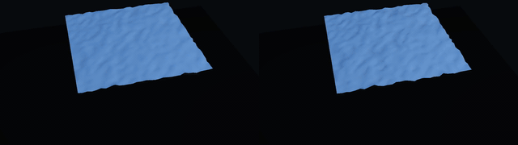
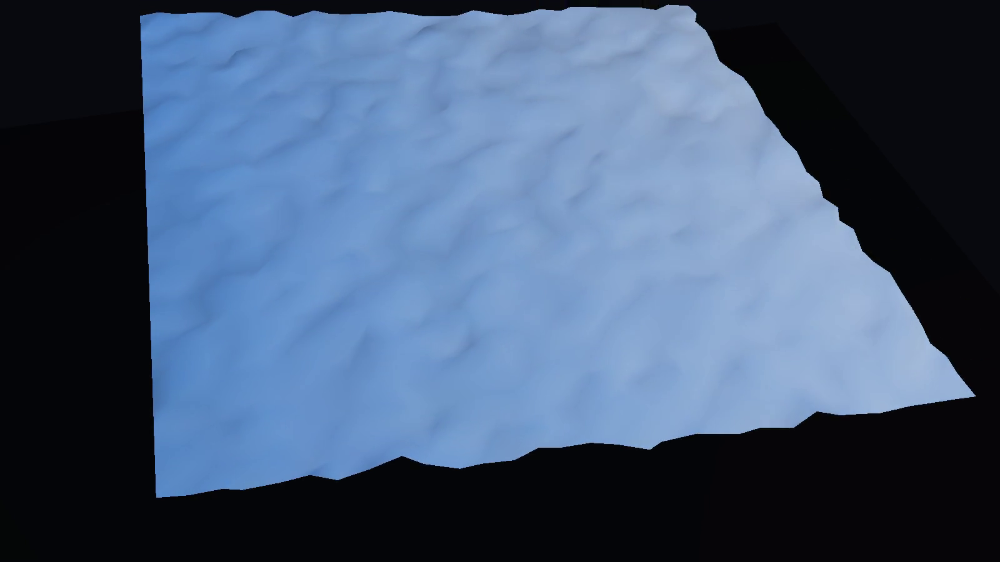

# clothgnn

### Demo

| Images |
| --- |
| <br> |


## Update (April 17, 2026)

- Configs, data loaders, dataset-generation scripts, training scripts, and export helpers were expanded around the core GNN.
- Demo assets, Taichi artifacts, and the static demo site are now tracked as part of the project surface.
- Shared collision, distillation, and export tooling now sit closer to the ClothGNN workflow.

## Overview
This project-space contains the clothgnn implementation and related resources.

## Structure

```
clothgnn__project-space/
├── README.md                 # This file
├── clothgnn/          # Source code
│   ├── src/
│   ├── notebooks/
│   ├── configs/
│   ├── checkpoints/          # Model weights (from vast.ai backups)
│   └── results/              # Benchmark outputs
├── docker/                   # Docker definitions
│   ├── Dockerfile
│   └── scripts/
├── docker-backups/           # Local backups (not in git)
│   ├── files/
│   └── archived/
└── docs/                     # Research documentation
```

## Quick Start

```bash
cd clothgnn
pip install -r requirements.txt  # if exists
python -m pytest tests/ -v       # run tests
```

## Related Documentation
See `docs/` directory for research notes and design documents.
