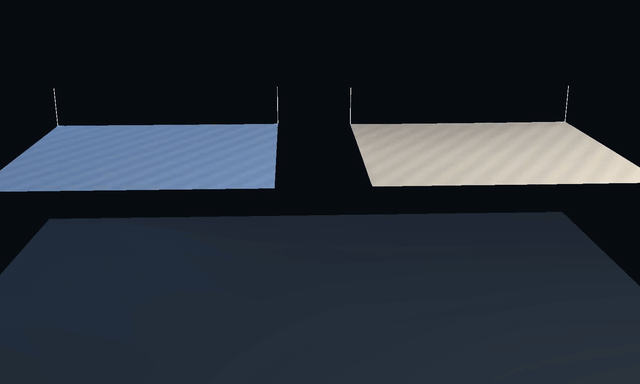
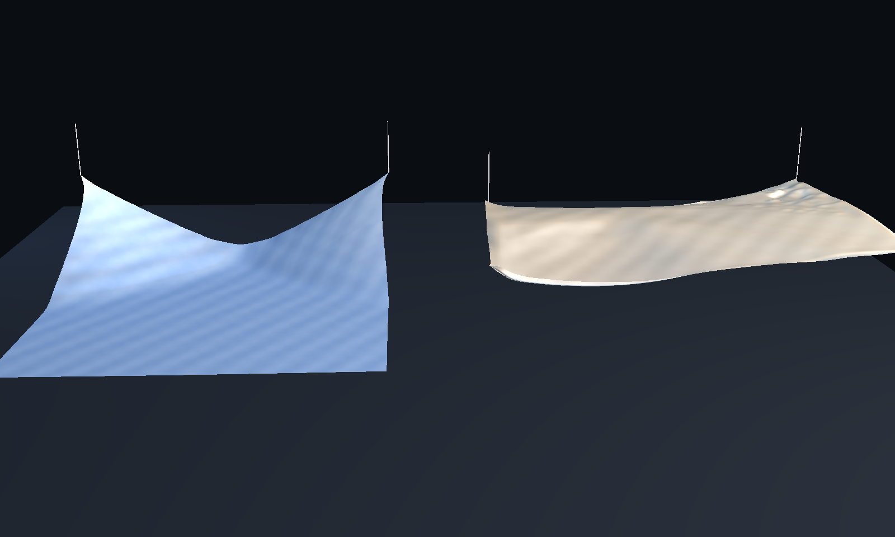

# hgnn-clothdyn

### Demo

| Videos (MP4/GIF) | Images |
| --- | --- |
| [comparison.mp4](hgnn-clothdyn/artifacts/taichi_final/comparison.mp4)<br>[hgnn_demo.mp4](hgnn-clothdyn/artifacts/taichi_final/hgnn_demo.mp4)<br>[physics_demo.mp4](hgnn-clothdyn/artifacts/taichi_final/physics_demo.mp4) | <br> |


## Update (April 17, 2026)

- Training, benchmarking, and synthetic-data scripts were revised around the current hierarchical cloth-dynamics workflow.
- Comparison media and Taichi outputs now live under tracked artifact bundles.
- Shared collision integration was added to keep this project closer to the common cloth stack.

## Overview
This project-space contains the hgnn-clothdyn implementation and related resources.

## Structure

```
hgnn-clothdyn__project-space/
├── README.md                 # This file
├── hgnn-clothdyn/          # Source code
│   ├── src/
│   ├── notebooks/
│   ├── configs/
│   ├── checkpoints/          # Model weights (from vast.ai backups)
│   └── results/              # Benchmark outputs
├── docker/                   # Docker definitions
│   ├── Dockerfile
│   └── scripts/
├── docker-backups/           # Local backups (not in git)
│   ├── files/
│   └── archived/
└── docs/                     # Research documentation
```

## Quick Start

```bash
cd hgnn-clothdyn
pip install -r requirements.txt  # if exists
python -m pytest tests/ -v       # run tests
```

## Related Documentation
See `docs/` directory for research notes and design documents.
