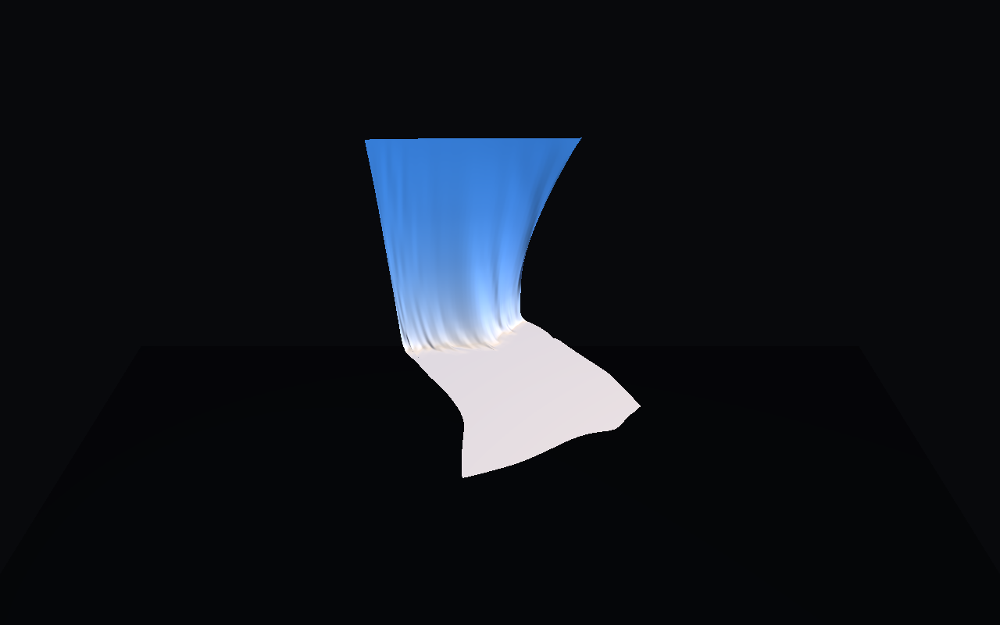

# hgnn-nif-cloth

### Demo

| Images |
| --- |
| <br> |


## Update (April 17, 2026)

- This project-space is now the fuller demo-oriented variant, with rollout metrics, outputs, demo-site assets, and Taichi media.
- Training, physics-data generation, and rollout/metrics scripts were added around the hybrid model workflow.
- Use this variant when you need the end-to-end animation and demo path rather than the lighter base tree.

## Overview
This project-space contains the hgnn-nif-cloth implementation and related resources.

## Structure

```
hgnn-nif-cloth__project-space/
├── README.md                 # This file
├── hgnn-nif-cloth/          # Source code
│   ├── src/
│   ├── notebooks/
│   ├── configs/
│   ├── checkpoints/          # Model weights (from vast.ai backups)
│   └── results/              # Benchmark outputs
├── docker/                   # Docker definitions
│   ├── Dockerfile
│   └── scripts/
├── docker-backups/           # Local backups (not in git)
│   ├── files/
│   └── archived/
└── docs/                     # Research documentation
```

## Quick Start

```bash
cd hgnn-nif-cloth
pip install -r requirements.txt  # if exists
python -m pytest tests/ -v       # run tests
```

## Related Documentation
See `docs/` directory for research notes and design documents.
