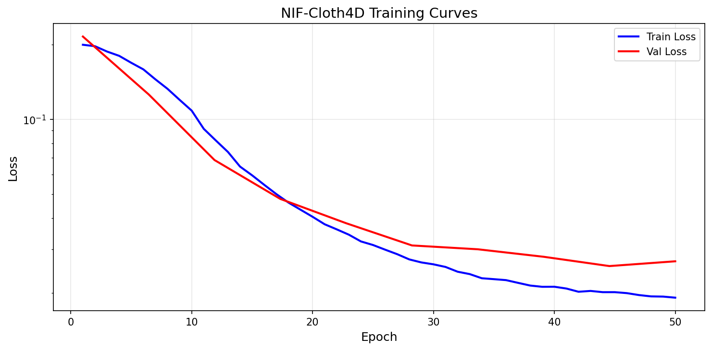
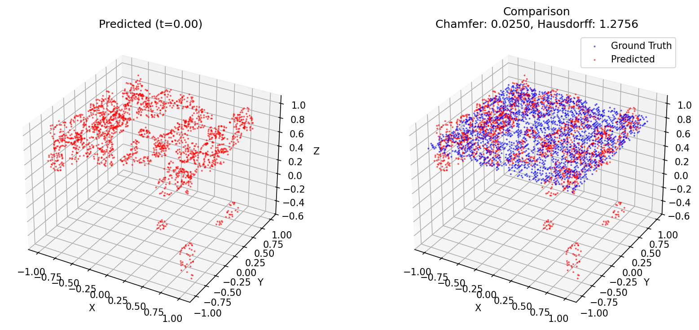
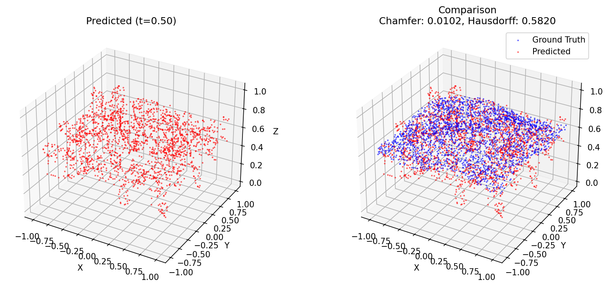
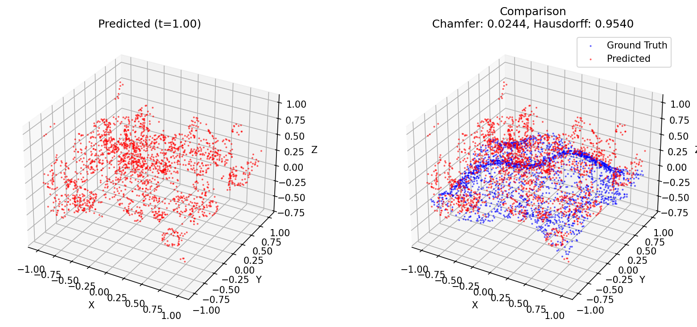

# NIF-Cloth4D Test Report Template

## Test Configuration

| Parameter | Value |
|-----------|-------|
| **Date** | [DATE] |
| **GPU Instance** | [GPU_TYPE] |
| **VRAM** | [VRAM_GB] GB |
| **Cost/Hour** | $[COST]/hr |
| **Instance ID** | [INSTANCE_ID] |

## Phase 1: Environment Setup

### Instance Creation
- [ ] Vast.ai instance created successfully
- [ ] GPU confirmed: NVIDIA L40S (48GB)
- [ ] SSH connection established
- [ ] Jupyter access available

**Instance Details:**
```
Instance ID: [INSTANCE_ID]
GPU: [GPU_NAME]
VRAM: [VRAM] GB
Disk: [DISK] GB
Cost: $[COST]/hr
SSH Command: vastai ssh instance [INSTANCE_ID]
```

### Dependencies Installation
- [ ] PyTorch with CUDA
- [ ] trimesh, mesh-to-sdf, h5py
- [ ] PyMCubes
- [ ] usd-core (USD Python API)

**Installation Log:**
```
[PASTE INSTALLATION OUTPUT HERE]
```

## Phase 2: Data Generation

### Synthetic Data Stats

| Metric | Value |
|--------|-------|
| **Data Type** | falling / wavy / sphere |
| **Number of Frames** | [N_FRAMES] |
| **Grid Resolution** | [GRID_SIZE]³ |
| **Total Size** | [SIZE] MB |
| **Generation Time** | [TIME] seconds |

**Output Files:**
```
/tmp/cloth_test_data/
├── sdf/
│   ├── frame_0000.h5 ([SIZE] KB)
│   ├── frame_0001.h5 ([SIZE] KB)
│   └── ...
└── metadata.txt
```

## Phase 3: Training

### Model Configuration

| Parameter | Value |
|-----------|-------|
| **Hidden Dim** | 128 |
| **Hidden Layers** | 4 |
| **Input Dim** | 4 (x,y,z,t) |
| **Total Parameters** | [N_PARAMS] |

### Training Configuration

| Parameter | Value |
|-----------|-------|
| **Epochs** | 50 |
| **Batch Size** | 8,192 |
| **Learning Rate** | 1e-4 |
| **Optimizer** | Adam |
| **Scheduler** | CosineAnnealingLR |

### Training Results

| Metric | Value |
|--------|-------|
| **Final Train Loss** | [LOSS] |
| **Best Val Loss** | [VAL_LOSS] |
| **Training Time** | [TIME] minutes |
| **Peak GPU Memory** | [MEM] GB |

**Loss Progression:**
```
Epoch 1:  Train: [LOSS], Val: [VAL]
Epoch 10: Train: [LOSS], Val: [VAL]
Epoch 25: Train: [LOSS], Val: [VAL]
Epoch 50: Train: [LOSS], Val: [VAL]
```

### Loss Curve


## Phase 4: Evaluation

### Geometric Metrics

| Time | Chamfer Distance | Hausdorff Distance |
|------|------------------|-------------------|
| t=0.0 | [VALUE] | [VALUE] |
| t=0.5 | [VALUE] | [VALUE] |
| t=1.0 | [VALUE] | [VALUE] |
| **Average** | **[AVG]** | **[AVG]** |

### Success Criteria

| Criterion | Target | Achieved | Status |
|-----------|--------|----------|--------|
| Loss < 0.01 by epoch 50 | < 0.01 | [VALUE] | ✅/❌ |
| Chamfer Distance < 0.05 | < 0.05 | [VALUE] | ✅/❌ |
| USD files exported | 3 files | [N] files | ✅/❌ |
| Files non-empty | > 1 KB | [STATUS] | ✅/❌ |

### Mesh Comparison Visualization




## Phase 5: Export Verification

### Exported Files

| File | Size | Valid |
|------|------|-------|
| cloth_t0_000.usda | [SIZE] KB | ✅/❌ |
| cloth_t0_500.usda | [SIZE] KB | ✅/❌ |
| cloth_t1_000.usda | [SIZE] KB | ✅/❌ |
| cloth_t0_000.obj | [SIZE] KB | ✅/❌ |
| cloth_t0_500.obj | [SIZE] KB | ✅/❌ |
| cloth_t1_000.obj | [SIZE] KB | ✅/❌ |

## GPU Utilization

```
[PASTE nvidia-smi OUTPUT HERE]
```

**Resource Usage Summary:**
- Peak GPU Memory: [MEM] GB / 48 GB
- GPU Utilization: [UTIL]%
- Estimated Total Cost: $[COST]

## Issues and Solutions

### Issue 1: [ISSUE TITLE]
**Problem:** [Description]
**Solution:** [How it was resolved]

### Issue 2: [ISSUE TITLE]
**Problem:** [Description]
**Solution:** [How it was resolved]

## Cleanup

**⚠️ IMPORTANT: Destroy instance to avoid charges!**

```bash
# Check instance status
vastai show instances

# Destroy instance
vastai destroy instance [INSTANCE_ID]

# Verify destruction
vastai show instances
```

## Summary

### Overall Status: ✅ SUCCESS / ⚠️ PARTIAL / ❌ FAILED

**Achievements:**
- [ ] Environment setup complete
- [ ] Synthetic data generated
- [ ] Model trained successfully
- [ ] Loss target met (< 0.01)
- [ ] Chamfer distance target met (< 0.05)
- [ ] USD export successful
- [ ] All files verified

**Recommendations for Full Training:**
1. Increase epochs to 1000+ for production
2. Use 256 hidden dim for more capacity
3. Add physical losses (stretch, bend) for realism
4. Generate Blender simulation data for validation
5. Consider multi-resolution training

---
*Report generated by NIF-Cloth4D test pipeline*
