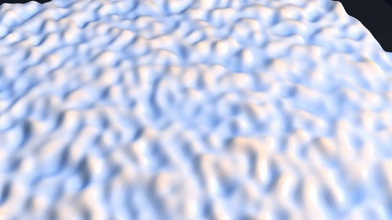
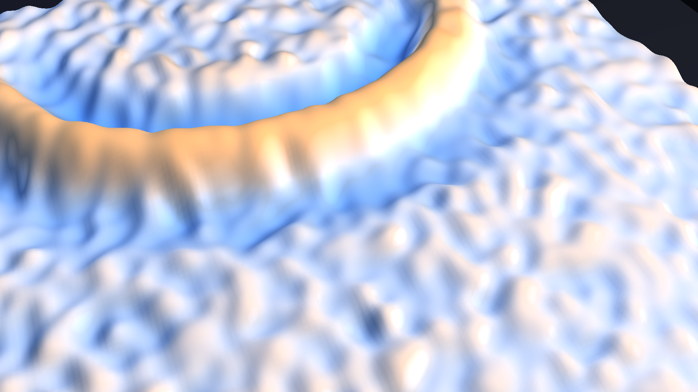

# wavepinn-nif

### Demo

| Videos (MP4/GIF) | Images |
| --- | --- |
| [wave_demo.mp4](wavepinn-nif/artifacts/taichi_final/wave_demo.mp4) | <br> |


## Update (April 17, 2026)

- Project 17 saw substantial private-head updates around the Taichi viewer, supervised-FD training and validation helpers, and demo/export tooling.
- Artifact bundles and demo-site assets are now part of the tracked workflow rather than side notes.
- The practical runtime story is now documented around the current PyTorch and Taichi stack.

## Overview
This project-space contains the wavepinn-nif implementation and related resources.

## Structure

```
wavepinn-nif__project-space/
├── README.md                 # This file
├── wavepinn-nif/          # Source code
│   ├── src/
│   ├── notebooks/
│   ├── configs/
│   ├── checkpoints/          # Model weights (from vast.ai backups)
│   └── results/              # Benchmark outputs
├── docker/                   # Docker definitions
│   ├── Dockerfile
│   └── scripts/
├── docker-backups/           # Local backups (not in git)
│   ├── files/
│   └── archived/
└── docs/                     # Research documentation
```

## Quick Start

```bash
cd wavepinn-nif
pip install -r requirements.txt  # if exists
python -m pytest tests/ -v       # run tests
```

## Related Documentation
See `docs/` directory for research notes and design documents.
